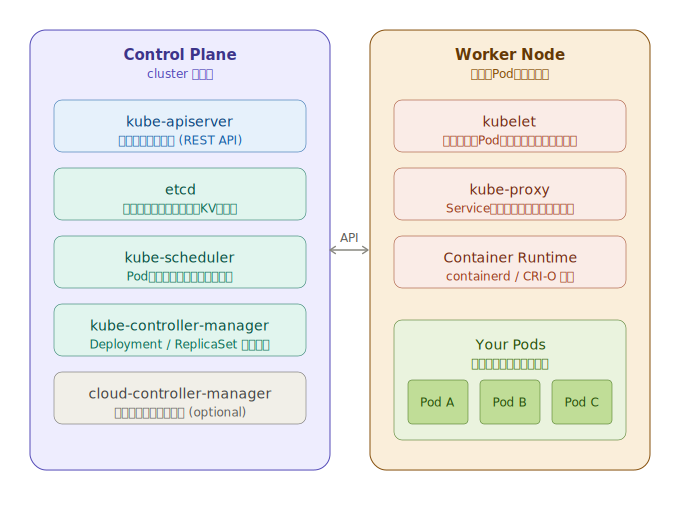

# 01. 環境構築

## 概要

kind (Kubernetes in Docker) を使ってローカルにKubernetesクラスタを作る。

kindはDockerコンテナをノードとして動かす本物のKubernetes。本番環境に近い挙動で学べる。

## 前提条件

- Docker Desktop がインストール済み・起動中であること

## インストール

```bash
brew install kind kubectl
```

- `kind`: ローカルKubernetesクラスタの管理ツール
- `kubectl`: Kubernetesクラスタを操作するCLI

## クラスタとは

Kubernetesクラスタは「アプリを動かすためのサーバーの集まり」。2種類のノードで構成される。



```
┌─────────────────────────────────────┐
│          Kubernetes クラスタ         │
│                                     │
│  ┌─────────────────┐                │
│  │  Control Plane  │  ← 司令塔。スケジューリングや状態管理を担当
│  └─────────────────┘                │
│                                     │
│  ┌──────┐ ┌──────┐ ┌──────┐        │
│  │Node 1│ │Node 2│ │Node 3│  ← 実際にアプリ(Pod)が動く場所
│  └──────┘ └──────┘ └──────┘        │
└─────────────────────────────────────┘
```

- **Control Plane**: クラスタ全体を管理する頭脳。「どのノードで何を動かすか」を決める
- **Node**: アプリのコンテナが実際に動くマシン（物理・仮想どちらでも可）

kindの場合、これらのノードがDockerコンテナとして動く。本物のKubernetesと同じ仕組みをローカルで再現している。

## クラスタ作成

```bash
kind create cluster --name mycluster
```

作成後、自動的に `kubectl` のコンテキストが `kind-mycluster` に切り替わる。

> **コンテキストとは**: 「どのクラスタに対して操作するか」の設定。複数クラスタを扱うときに切り替えて使う。

## 動作確認

```bash
# ノード確認
kubectl get nodes

# 期待する出力:
# NAME                      STATUS   ROLES           AGE   VERSION
# mycluster-control-plane   Ready    control-plane   ...   v1.x.x
```

## クラスタ削除 (不要になったとき)

```bash
kind delete cluster --name mycluster
```

## 次のステップ

→ [02-basic-operations.md](./02-basic-operations.md) (作成予定)
