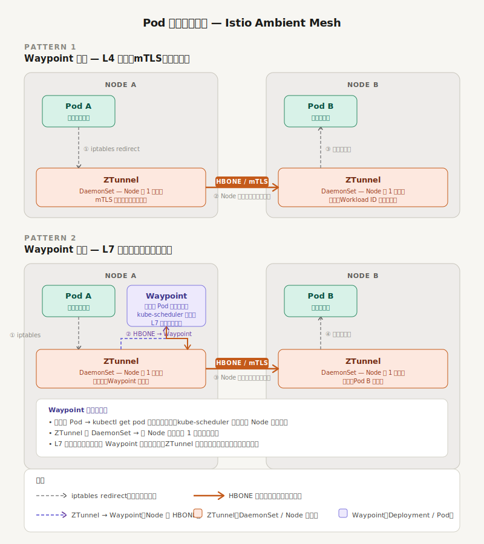

# Istio / ZTunnel まとめ

## Istio とは

Kubernetes の上に乗る**サービスメッシュ**。
Kubernetes が「どこに届けるか」を担うのに対して、Istio は「**信頼できるか・見えているか**」を担う。

---

## Kubernetes Service との役割分担

| レイヤー | 担当 | 具体的な仕組み |
|---|---|---|
| アプリケーション | HTTP / gRPC など | Pod 内のコード |
| **Istio / ZTunnel** | mTLS・ポリシー・可観測性 | ZTunnel (Ambient) or Sidecar (Envoy) |
| Kubernetes Service | 宛先解決・ルーティング | ClusterIP / kube-proxy / iptables |
| Node ネットワーク | パケット転送 | CNI (Flannel / Calico など) |

> **Istio は ClusterIP の代替ではなく、その上に乗る追加レイヤー。両方が同時に動作する。**

---

## Istio が具体的にやること

### ① mTLS（相互 TLS 認証）
- Pod 間の通信で双方向の証明書検証を行う
- 「本当に Pod B か？」をなりすまし防止
- 証明書は istiod が自動発行・ローテーション（SPIFFE/SVID）

### ② 暗号化
- Pod 間・Node 間の通信をすべて暗号化
- アプリ側のコード変更ゼロで平文パケットをなくせる

### ③ L4 ポリシー強制
- 「Service A は Service B としか通信できない」といったルールを強制
- Kubernetes の NetworkPolicy より細かい **Workload Identity（SPIFFE ID）** ベースで制御

### ④ テレメトリ収集
- リクエスト数・レイテンシ・エラー率を Pod に手を加えずに収集
- Prometheus / Grafana / Loki などに流せる

---

## ZTunnel（Ambient Mesh モード）

### サイドカーモデルとの違い

| | サイドカー (Envoy) | ZTunnel (Ambient) |
|---|---|---|
| 配置 | Pod 内に注入 | Node 単位 (DaemonSet) |
| 担当レイヤー | L4 + L7 | **L4 のみ** |
| Pod への影響 | あり（再起動必要） | なし |
| L7 機能 | あり | Waypoint Proxy に委譲 |
| リソース効率 | Pod 数分だけ Envoy が起動 | Node 1 つにつき 1 プロセス（Rust 製で軽量） |

### 通信の流れ

```
Pod A
  │
  │ iptables redirect（アプリは意識しない）
  ▼
ZTunnel (Node A)
  │
  │ HBONE トンネル（mTLS）
  ▼
ZTunnel (Node B)
  │
  │ 復号・Workload ID 検証
  ▼
Pod B
```

**HBONE**（HTTP-Based Overlay Network Encapsulation）: ZTunnel 間をつなぐ独自トンネルプロトコル。

### L7 が必要な場合：Waypoint Proxy

L7 ポリシー（HTTP ルーティング・ヘッダー操作・リトライなど）が必要なときは **Waypoint Proxy**（Envoy ベース）を別途挟む。

```
Pod A
  │ iptables redirect
  ▼
ZTunnel (Node A)
  │ HBONE
  ▼
ZTunnel (Waypoint が乗っている Node)
  │
  ▼
Waypoint Proxy Pod（L7 処理）
  │
  ▼
ZTunnel (Node B)
  │
  ▼
Pod B
```

---

## Waypoint Proxy

### ZTunnel との違い

| | ZTunnel | Waypoint Proxy |
|---|---|---|
| 配置単位 | DaemonSet（Node 固定） | Deployment（普通の Pod） |
| どこに乗るか | 全 Node に必ず 1 つ | kube-scheduler が決める |
| 担当レイヤー | L4（mTLS・暗号化） | L7（HTTP・gRPC レベル） |
| 適用単位 | Node 全体 | Namespace / ServiceAccount 単位 |
| 必須か | 常に動作 | 必要なサービスだけ追加 |



### Waypoint が担う L7 機能

- HTTP/gRPC レベルのルーティング（パス・ヘッダーによる振り分け）
- リトライ・タイムアウト・サーキットブレーカー
- リクエストヘッダーの追加・書き換え・削除
- L7 レベルのトラフィックポリシー（AuthorizationPolicy）
- HTTPレベルのテレメトリ（メソッド・ステータスコード単位のメトリクス）

### 適用単位

```yaml
# Namespace 単位で有効化
apiVersion: v1
kind: ServiceAccount
metadata:
  name: my-service
  namespace: my-namespace
  annotations:
    istio.io/use-waypoint: my-waypoint

---
# Waypoint 本体のデプロイ
apiVersion: gateway.networking.k8s.io/v1
kind: Gateway
metadata:
  name: my-waypoint
  namespace: my-namespace
spec:
  gatewayClassName: istio-waypoint
  listeners:
  - name: mesh
    port: 15008
    protocol: HBONE
```

### いつ Waypoint を使うか

| ユースケース | ZTunnel のみ | Waypoint 追加 |
|---|---|---|
| mTLS・暗号化だけでいい | ✓ | 不要 |
| サービス間の認証・認可（L4）| ✓ | 不要 |
| HTTP パスベースのルーティング | ✗ | 必要 |
| リトライ・サーキットブレーカー | ✗ | 必要 |
| ヘッダー操作・トラフィックシェイピング | ✗ | 必要 |

> **L7 が不要なサービスには Waypoint を立てない。ZTunnel のみの方がオーバーヘッドが少ない。**

### SRE 観点での注意点

- Waypoint は普通の Pod なので `kubectl get pod` で確認できる
- Waypoint 障害時は対象 Namespace の L7 ポリシーが効かなくなる（L4 は ZTunnel が継続）
- `istioctl proxy-status` で Waypoint の設定同期状態を確認できる

```bash
# Waypoint の確認
kubectl get gateway -n <namespace>

# Waypoint Pod の状態確認
kubectl get pod -l gateway.istio.io/managed=istio.io-mesh-controller -n <namespace>

# Waypoint 経由の通信確認
istioctl proxy-status
```

---

## コントロールプレーン：istiod

- 証明書の発行・配布（CA）
- ポリシーの配布
- ZTunnel / Waypoint Proxy への設定プッシュ（xDS プロトコル）

---

## SRE 観点での活用ポイント

- **障害切り分け**：Pod 間通信失敗 → `istioctl ztunnel-config` でどのノードのどの ZTunnel が問題か特定
- **可観測性**：アプリ改修なしにゴールデンシグナル（Latency / Traffic / Errors / Saturation）取得
- **セキュリティ監査**：mTLS 強制により「誰が誰と通信したか」をログで追える

```bash
# ZTunnel の状態確認
istioctl ztunnel-config workload

# 特定 Pod のトラフィック確認
istioctl experimental ztunnel-config all -n <namespace>
```