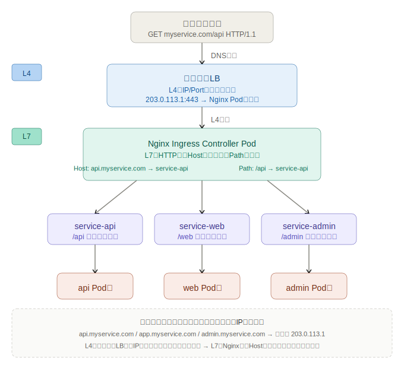

# Nginx Ingress Controller まとめ

## 通信の全体像

```
クライアント: myservice.com/api にアクセス
        ↓
  [DNS解決]
  myservice.com → 203.0.113.1 (IPアドレス)
        ↓
  [クラウドLB]
  L4（IP/Port）で受ける
  「203.0.113.1:443 に来た → Nginx Ingress Podに流す」
        ↓
  [Nginx Ingress Controller Pod]
  L7（HTTP）で解釈する
  「Host: myservice.com, Path: /api → service-api に流す」
        ↓
  [Service]
  対象Podへ振り分け
        ↓
  [Pod]
```



---

## なぜ Host を見る必要があるのか

### バーチャルホストという仕組み

DNSは**複数のドメインを同じIPに向けられる**。

```
api.myservice.com  →  203.0.113.1 ┐
app.myservice.com  →  203.0.113.1 ├ すべて同じIP
admin.myservice.com → 203.0.113.1 ┘
```

### クラウドLBは区別できない

クラウドLBはL4（IP/Port）しか見ないため、同じIPに来たリクエストが
`api` 宛てなのか `app` 宛てなのか判断できない。

HTTPリクエストには `Host:` ヘッダーが含まれているが、L4ではそれが見えない。

```
# HTTPリクエストの中身（L7の情報）
GET /top HTTP/1.1
Host: api.myservice.com   ← これがL4には見えない
```

### Nginx が Host ヘッダーを見て解決する

```
203.0.113.1 に来た
  ↓
Host: api.myservice.com   → service-api へ
Host: app.myservice.com   → service-app へ
Host: admin.myservice.com → service-admin へ
```

→ **LBは1つのIPだけでよく、コストが抑えられる**

---

## なぜ Path を見る必要があるのか

### Service の限界

KubernetesのServiceは「このServiceに来たリクエストはこのPod群へ」しか言えない。
**パスを見てServiceを選ぶ仕組みがKubernetesにはネイティブに存在しない。**

### パスベースルーティングで何が嬉しいか

```
myservice.com/api   → service-api   → api用Pod群
myservice.com/web   → service-web   → web用Pod群
myservice.com/admin → service-admin → admin用Pod群
```

- ユーザーから見たら **1つのドメイン**
- 裏では **独立したPod・デプロイサイクル・スケーリング**

マイクロサービスを1ドメインで束ねつつ、裏側は完全に分離できる。

---

## Service type:LoadBalancer との比較

| | type:LoadBalancer | Nginx Ingress |
|---|---|---|
| 動作レイヤー | L4（IP/Port） | L7（HTTP） |
| 見るもの | IPとPortのみ | HostヘッダーとPath |
| ルーティング | Port単位 | Host・Path単位 |
| TLS終端 | 辛い | 得意（cert-managerと組み合わせ） |
| コスト | サービスごとにLBが増える | LBは1つ、Ingressにルールを書くだけ |

### type:LoadBalancer を各サービスに貼った場合

```
api.example.com   → LB-IP-1 → service-api
app.example.com   → LB-IP-2 → service-app
admin.example.com → LB-IP-3 → service-admin
```

→ サービス数だけLBが増えてコスト爆発

### Nginx Ingress を使った場合

```
api.example.com  ┐
app.example.com  ├ → LB-IP 1つ → Nginx が振り分け
admin.example.com┘
```

→ LBは1個、Ingressリソースにルールを書くだけ

---

## Nginx Ingress の Kubernetes 上での位置づけ

- Kubernetes の **Pod として cluster 内で動く**
- 通常は `kube-system` namespace に deploy される
- Nginx Ingress Controller 自体も `type:LoadBalancer` な Service で外部公開される

つまり構成は **「クラウドLB → Nginx Ingress Pod → 各Service → Pod」** という2段構え。

---

## Ingress リソースの例

```yaml
apiVersion: networking.k8s.io/v1
kind: Ingress
metadata:
  name: myservice-ingress
  annotations:
    nginx.ingress.kubernetes.io/rewrite-target: /
spec:
  rules:
  - host: myservice.com
    http:
      paths:
      - path: /api
        pathType: Prefix
        backend:
          service:
            name: service-api
            port:
              number: 80
      - path: /web
        pathType: Prefix
        backend:
          service:
            name: service-web
            port:
              number: 80
```