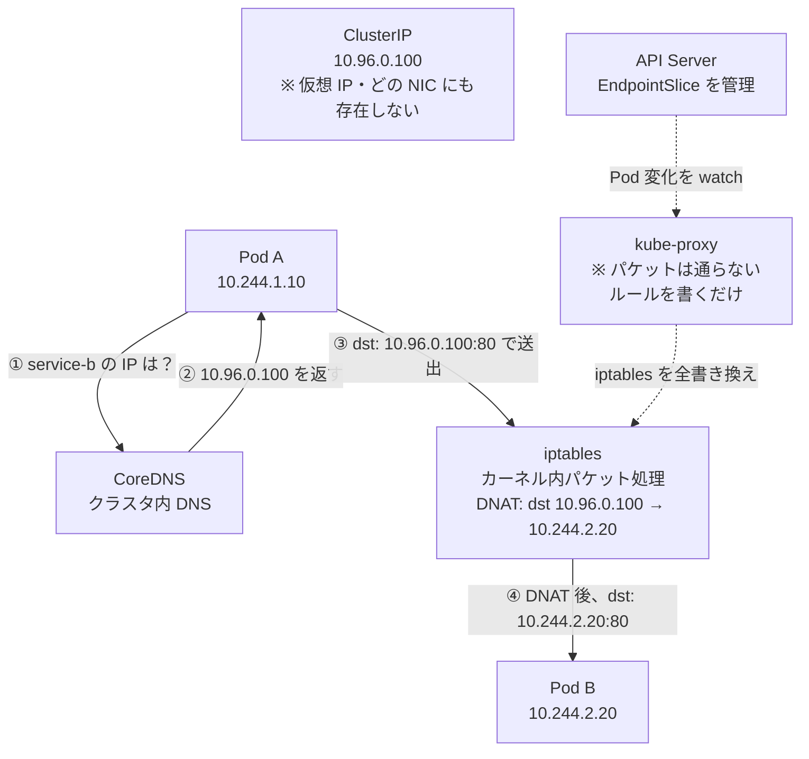

# Kubernetes Service の仕組み

## TL;DR

Service は「実体のある Pod」ではなく、**kube-proxy がノードの iptables に書いたルールの集合体**。  
ClusterIP は仮想 IP で、どの NIC にも存在しない。

type については以下を参照

[[[service-type.md]]](./service-type.md)

---

## 登場人物

| 名前 | 役割 |
|---|---|
| **ClusterIP** | Service ごとに割り当てられる仮想 IP。どの NIC にも bind されていない |
| **CoreDNS** | `service-b.namespace.svc.cluster.local` → ClusterIP を返す DNS |
| **kube-proxy** | 全ノードで動く DaemonSet。iptables にルールを書き込む係 |
| **iptables** | カーネル内のパケット処理エンジン。DNAT・確率分岐・ポート変換などができる |
| **EndpointSlice** | Service に紐づく実 Pod の IP 一覧。API Server が管理する |

---

## Service の IP は「架空の IP」

```
ローカル IP  → NIC に bind されている、実在するアドレス
ClusterIP   → どの NIC にも存在しない、iptables のルールの中にしかない
```

`ip addr` で探しても出てこない。  
存在するのは kube-proxy が書いた iptables ルールの中だけ。

---

## 通信の流れ



**kube-proxy はパケットの経路上にいない。**  
iptables にルールを書くのが仕事で、書いたら後はカーネルが全部やる。

---

## Service ごとに別の ClusterIP が割り当てられる

```
Service B → 10.96.0.100
Service C → 10.96.0.101
Service D → 10.96.0.102
```

宛先 IP が違うので、iptables はどの Service 向けかを区別できる。

---

## 複数 Pod へのロードバランシング

Pod が複数ある場合、iptables の確率ルールで分散する。

```
dst: 10.96.0.100 が来たら
  → 33% の確率で 10.244.1.10
  → 50% の確率で 10.244.1.11  ← 残り 2 つで半々
  → 100% の確率で 10.244.2.20  ← 最後は確定
```

iptables は「テーブル」という名前だが、実態は**カーネル内のパケット処理ルールエンジン**で以下ができる：

- 宛先 IP 書き換え (DNAT)
- 確率分岐 (`--probability 0.33`)
- パケットの破棄
- ポート変換

ただし **iptables の LB はかなり雑**：
- ランダムなだけで Pod の負荷を見ない
- 死んだ Pod にも一瞬流れる（kube-proxy が更新するまでのタイムラグ）
- Pod 数が増えると確率計算のルールが連鎖して遅くなる

本気で LB したいなら Ingress Controller や Service Mesh (Istio など) を前に置くのが普通。

---

## kube-proxy の役割

```
起動時・Pod 変化時：
  API Server の EndpointSlice を watch
        ↓
  iptables ルールを全書き換え
        ↓
  次のパケットから新しいルールが適用される
```

**「更新」ではなく「全書き換え」** なのがポイント。  
Pod が 1 個増えるだけで、その Service に関係するルールを丸ごと作り直す。

### 全ノードに全 Service のルールが入っている

```
Node A にいる Pod が Service B に行きたい
Node B にいる Pod が Service B に行きたい
Node C にいる Pod が Service B に行きたい

→ A, B, C 全ノードの iptables に Service B のルールがある
```

どのノードからどの Service に行っても解決できるよう、**全ノードが全 Service を知っている状態**を kube-proxy が維持している。

---

## ルール数のスケール問題

ルール数は概算で：

```
Service 数 × Pod 数 × Node 数
```

これが「大規模だと iptables がしんどい」の正体。

### 代替手段

| モード | 特徴 |
|---|---|
| **iptables モード** | デフォルト。Pod 数が増えると遅くなる |
| **IPVS モード** | ハッシュテーブルベース。大規模向け |
| **Cilium (eBPF)** | kube-proxy 不要。カーネル内に直接ルールを書く。最も高速 |

---

## まとめ

- **Service の正体** = kube-proxy が各ノードの iptables に書いた転送ルールの集合体
- **ClusterIP** = 架空の IP。iptables ルールの中にしか存在しない
- **kube-proxy** = DaemonSet として全ノードで動く。パケットは通らず、ルールを書くだけ
- **iptables** = カーネルのパケット処理エンジン。DNAT + 確率 LB を担う
- **スケール** = Service・Pod・Node が増えるほどルール数が爆発 → 大規模では IPVS / eBPF へ